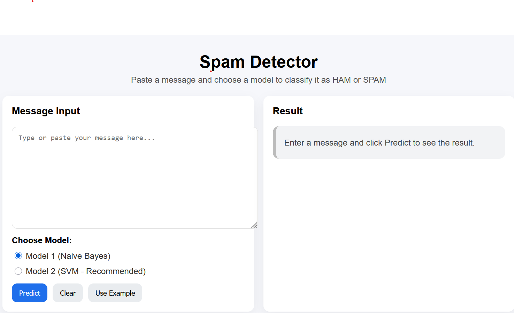

# Spam-Message-Detection-ML
Machine Learning web app to detect spam messages using Naive Bayes and SVM with Flask.

## Technologies Used

- Python
- Flask
- HTML/CSS
- Scikit-learn
- Naive Bayes
- SVM

## Features

- Detect spam messages
- Choose between Naive Bayes and SVM
- User-friendly web interface

## Run

pip install -r requirements.txt

python app.py

